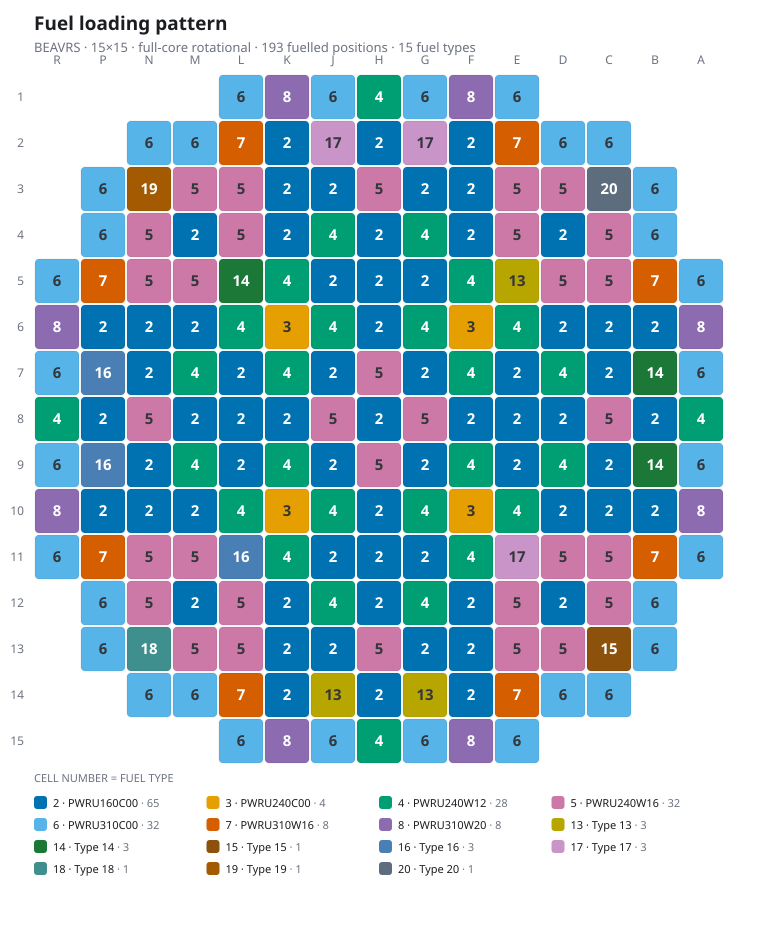
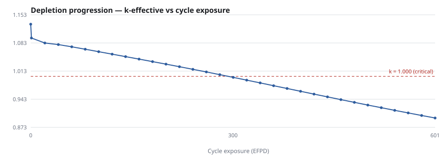
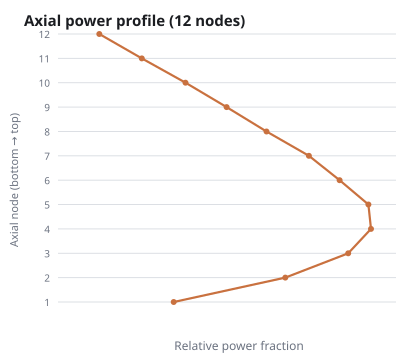

# Vision: Nuclear Core Analysis

A web dashboard that turns a SIMULATE-3 listing(.out) into something readable 😌.

---

## What this is

**SIMULATE-3** is a simulator used across the nuclear industry to model what
happens inside a reactor core. Engineers use it to answer questions like *where
is the power highest?*, *how evenly is the fuel burning up?*, and *how long will
this fuel load last before the reactor can no longer sustain the reaction?*

When it finishes, SIMULATE-3 writes its answers to a plain text file — a
`.out` file, sometimes called a *listing*. That file is the problem this
project solves.

A typical listing is **ten to thirteen thousand lines** of fixed-width text
laid out for a 1970s line printer. Everything is in there — but it is spread
across two hundred numbered pages, the same map is reprinted for every one of
thirty depletion steps, and the numbers sit in rigid columns with no headers to
anchor them:

```
 PRI.STA 2RPF  - Assembly 2D RPF - Relative Power Fraction
 **    9     10     11     12     13     14     15     16     17     **
  9  1.155  0.831  1.245  1.314  0.836  1.092  1.323  0.899  0.947   09
 10  0.831  1.180  0.891  0.963  0.899  1.296  0.932  1.388  0.978   10
```

The above is one map, at one moment in time, for one quarter of the core. A single
run contains hundreds of them.

**This tool reads that file and gives you:**

- an **interactive core map** you can colour by power, burnup, fuel type,
  control rods or any other quantity the run produced
- a **click-anywhere inspector** showing everything known about one fuel
  assembly
- **charts** of how the core changes as the fuel burns up
- a **diagnostics review** of every warning the simulator raised, including
  which specific fuel positions failed its internal symmetry checks
- a **searchable index** of every section in the file, with the original text
  one click away

Nothing is recomputed or estimated. Every number shown is read straight out of
the listing (the .out file), thus ensuring numbers don’t get invented out of thin air .




<p align="center">
  
  
</p>

<sub>Rendered from a SIMULATE-3 run of
[BEAVRS](https://crpg.mit.edu/research/beavrs/),
an openly published MIT reactor benchmark. Regenerate with
`python tools/make_readme_assets.py your_run.out`.</sub>

---

## Why use this rather than what you already do

In practice, people inspect these files in one of two ways. Both have real
costs that this tool removes.

**1. Open the file in a text editor and search.**
This is what most people do most of the time. It works, but you are
reconstructing a 17×17 grid in your head from numbers printed in bands, for a
quarter of the core, and mentally rotating it to fill in the rest. Comparing
step 3 with step 27 means scrolling between two points thousands of lines
apart. Spotting that one anomalous assembly out of 241 is close to hopeless.

**2. Write a script for the run you happen to be looking at.**
Faster the first time, but such scripts are written against one file. They
hard-code the core width, assume the variables that run happened to print, and
break silently on the next file — usually not by crashing, but by returning a
*plausible wrong number*. This project began that way, and the section below on
correctness lists fourteen bugs of exactly that kind that had to be found and
fixed.

**What this does differently:**

| | |
|---|---|
| **Reads the text output directly** | No extra files, no simulator licence, no export step. If you have the `.out`, you can use this. |
| **Does not break on unfamiliar files** | It parses the *shapes* SIMULATE-3 prints, not a fixed list of variable names — so a quantity it has never seen still comes through. See [How it works](#how-it-works). |
| **Checks itself** | Listings state many quantities twice, in different places. The parser compares its results against the file's own arithmetic and reports any disagreement instead of quietly picking one. |
| **Says when it does not know** | Anything it could not parse is reported, not skipped. A partial read is visible rather than silent. |
| **Runs entirely on your machine** | No upload, no server, no network. Suitable for an air-gapped site. |

Vendor tools exist for viewing SIMULATE-3 results, and where you have one it
may well do more than this. They generally read the simulator's binary restart
files rather than the text listing, and require the corresponding licence. This
project is aimed at the common case where all you have is the `.out` file.

---

## Quick start

You are reading this on GitHub. Here is the whole path from here to a running
dashboard.

**1. Install Python 3.10 or newer**, if you do not already have it, from
[python.org/downloads](https://www.python.org/downloads/). On Windows, tick
*"Add Python to PATH"* during installation.

Check it worked by opening a terminal (Command Prompt or PowerShell on Windows,
Terminal on macOS/Linux) and running:

```bash
python --version
```

**2. Download this repository.** Either use the green **`< > Code`** button at
the top of this page → **Download ZIP**, then unzip it — or, if you have Git:

```bash
git clone https://github.com/AyachiMishra/NuclearCore-GUI.git
```

**3. Go into the folder** you just downloaded:

```bash
cd NuclearCore-GUI
```

**4. Install what it needs** (about 30 seconds):

```bash
python -m pip install -r requirements.txt
```

**5. Start it:**

```bash
python -m s3dash
```

Your browser opens at <http://127.0.0.1:8000>. If it does not, open that
address yourself.

**6. Load a file.** Click **Load listing**, then drag in a `.out` file or
browse to one. A 1 MB listing parses in well under a second.

To stop the server, press `Ctrl+C` in the terminal.

### Using your own files

**No `.out` files are included in this repository.** They are simulator output
for specific plant designs and are not ours to redistribute.

The upload button reads any file you point it at, whatever it is named — you
never need to do anything else. If you would rather have one-click buttons for
files you open often, drop them in the `sample_data/` folder and they will
appear on the load panel:

```
sample_data/
  your_cycle1.out
  your_cycle2.out
```

### Exports

| Format | What it is |
|---|---|
| **PDF report** | Eight pages: cover, contents with page numbers and working links, run summary, core map, every depletion step tabulated, axial distribution, fuel inventory, diagnostics with the symmetry breakdown, and provenance. Sections that do not apply to your run are left out rather than shown empty. |
| **PNG** | Any chart, or the core map, at double resolution |
| **CSV** | The full assembly table for the step you are viewing |
| **JSON** | Everything the parser extracted, for use in your own scripts |
| **Print** | All views as one document |

### Sharing a result

To hand someone a finished analysis without asking them to install anything:

```bash
python -m s3dash.bundle your_run.out -o your_run.html
```

That writes a single HTML file — the whole dashboard with the results built in,
which opens on a double-click with no Python and no internet. It carries
results, not the parser, so it cannot open *other* listings; for that, run the
server as above.

---

## How it works

The hard part is not drawing the core map. It is to read(parse) the file in the first place 🙂.

### The problem with the obvious approach

SIMULATE-3 can print roughly thirty different physical quantities — power,
exposure, temperature, xenon concentration and so on. Each can be printed on
about eight different bases: per assembly or per node, in two dimensions or
three, averaged or peak. That is already a couple of hundred possible section
names, before counting the separate families of pin-level, batch-level and
detector edits.

Which of them appear depends entirely on what the engineer asked for in that
particular run.

So a parser written as a list of known section names is guaranteed to fail on
the first file that uses one it was not told about. That is the trap the
throwaway-script approach falls into.

### The approach taken instead

Those hundreds of possible sections are printed in only **six physical
layouts**. A power map and a xenon map look identical on the page; only the
heading differs. So this parser reads *layouts*, not names:

| Layout | What is printed this way |
|---|---|
| Page banner | Every page — this is what tells you which case and depletion step the numbers below belong to |
| Banded grid | **Every** core map of every variable, plus the control-rod map |
| Bordered cell grid | The fuel-loading maps, where each cell stacks several fields |
| Ruled table | Fuel segments, batch summaries, diagnostics, the depletion history |
| Dot-leader pairs | The summary blocks: `Thermal Power . . . CTP  3983.8 MWt` |
| Framed cards | Symmetry-check failures, drawn as boxes laid out across the page |

A variable this parser has never encountered still comes through correctly,
because its *shape* is already understood. That is not a theoretical claim: one
of the three test files contains two variables the other two do not, and both
parse with no code written for them.

### Geometry is read and never assumed 👍

The same applies to the core itself. How wide it is, whether the file prints
the whole core or just a quarter of it, whether results are two- or
three-dimensional, and which symmetry rule maps a quarter onto the whole — all
of it is read from the file's own declarations. Everything downstream follows
from that, so nothing in the code assumes a 17×17 core or a quarter-core file.

### What that buys you

Development involved using three listings which were chosen because they disagree on **every axis
that holds importance**:

| | APR1400 run 1 | APR1400 run 2 | BEAVRS |
|---|---|---|---|
| Core width | 17×17 | 17×17 | **15×15** |
| Portion printed | quarter | quarter | **whole core** |
| Dimensions | 2D | 2D | **3D, 12 levels** |
| Burnup unit | GWd/MT | GWd/MT | **EFPD** |
| Extra variables | — | — | **two the others lack** |
| Fuel-loading maps | present | present | **absent** |
| Batch summaries | present | present | **absent** |
| Symmetry warnings | present | present | **absent** |
| Depletion steps | 31 | 28 | 32 |

Where a section is missing the tool degrades rather than fails: the BEAVRS run
has no fuel-loading maps and no batch summaries, and still produces a complete
193-assembly core map. Anything genuinely not understood is reported in the
interface rather than dropped.

---

## Correctness

For a tool whose whole purpose is inspection, a wrong number shown confidently
is worse than no tool at all. Three independent checks guard against that.

### 1. The file is checked against itself

Listings state many quantities more than once, in places written by different
parts of the simulator. Those are free correctness checks, and the parser uses
them:

- Expanding a quarter-core map to the whole core must produce exactly the
  assembly count the file states elsewhere — 241, 241 and 193 for the three
  test files.
- Fuel counted per type must match the file's own per-type totals.
- The multiplication factor at each step, printed once per step and again in a
  summary table at the end, must agree in both places.
- Control-rod positions counted from the map must match the total the file
  prints beneath it.

### 2. An independent re-implementation

`verify/` re-extracts values straight from the raw bytes using a **separate
implementation, deliberately written with a different technique for each
layout**, so a shared misunderstanding cannot hide in both. It compared
**147,151 values** across the three files and reports **zero discrepancies** —
including all 53,340 printed map cells, and about 57,000 checks that
symmetry-expanded positions really do mirror their originals.

### 3. Fourteen bugs, none visible in the first file

Reaching zero took fourteen fixes. **Every one of them was invisible in the
file originally used for development** — each surfaced only because a second
file, a third file, or the independent re-implementation disagreed. The most
consequential:

- **Cycle length was overstated by 0.94 GWd/MT.** When SIMULATE-3 searches for
  the end of a cycle it prints trial pages whose headline number is not the
  converged answer. The parser was reading the first one it saw. For anyone
  using this to compare fuel loading patterns, cycle length is often the
  quantity being optimised — so this mattered.
- **Two different numbering systems were being confused.** Fuel *type* numbers
  and fuel *segment* numbers happen to coincide in the APR1400 files and do not
  in BEAVRS, where the mix-up gave most of the core the wrong enrichment.
- **A whole class of fuel was silently dropped.** Where a column does not apply,
  the listing prints dashes rather than leaving it blank. Requiring a number
  there discarded 107 of BEAVRS's 193 assemblies without any error.
- **A value was filed under the wrong column heading** — a wrong number with a
  plausible name, which is the worst failure mode there is for a diagnostic
  tool.

Full findings in `verify/VERIFICATION_REPORT.md`.

### Running the tests

```bash
python -m pytest tests/ -q
```

Tests needing a real listing skip automatically when none is present, so a
fresh clone runs **69 tests** — the layout readers, the column arithmetic,
geometry handling and symmetry expansion. Put listings in `sample_data/` to
unlock the other 149, which check parsed values against figures the files state
about themselves, bringing the suite to **218**.

---

## Project layout

```
s3dash/
  parser/           reads the listing
    textutil.py       column arithmetic and number parsing
    document.py       pages, step context, section index
    geometry.py       core dimensions and symmetry expansion
    primitives.py     the six layout readers
    sections.py       layouts needing bespoke handling
    inputcards.py     the echoed input deck and fuel definitions
    build.py          assembles everything into one data structure
  web/
    app.py            the server
    report.py         standalone HTML report
    pdfreport.py      the PDF report
    static/           the dashboard itself
  check.py          self-consistency checker
  bundle.py         single-file export
tests/              automated tests
verify/             independent re-implementation and its findings
tools/              README image generation
docs/               data format and design notes
```

---

## Extending it

Most additions need no code at all — a new variable is already handled by the
existing layout readers. For a genuinely new layout:

1. Add a pattern to `_ANCHORS` in `parser/document.py` so the section is found.
2. Point it at whichever layout reader matches, or add a new one if the shape
   is genuinely new.
3. Add a test using text copied verbatim from a real listing, and an assertion
   tied to something the file states about itself.

Sections the parser does not recognise are never discarded — they remain
reachable through the navigator and the raw text viewer.

`docs/API_CONTRACT.md` describes the data structure the interface consumes.

---

## Known limits

A tool that overstates what it covers is worse than one that is honest about
the gaps. These are the gaps.

**Things it does not do yet**

- **One file at a time.** There is no side-by-side comparison of two runs.
- **Axial detail is core-wide, not per assembly.** For three-dimensional runs
  you get how power varies with height averaged over the core. Getting it for
  one specific assembly requires the run to have printed a fuller set of
  results than any test file did.

**Things believed to work but not proven on real files**

The three files used for development are all pressurised-water reactors using
the same symmetry rule. The following are implemented and tested against
constructed examples, but have never been run against genuine output:

- **Boiling-water reactors.** Nothing in the design is specific to pressurised
  reactors, but no BWR listing was available to confirm it.
- **Two of the less common symmetry conventions.** Real files exercised only
  the most common one.
- **Very wide cores** whose maps get split across a page break mid-map. The
  code to stitch them exists but no available file triggered it.
- **Partially inserted control rods.** Every test file had all rods fully
  withdrawn.

If you have such a file, it is worth checking the results carefully the first
time — and a report of what went wrong would be genuinely useful.

**Smaller things**

- Two of the fuel-loading map types are read but not yet shown in the
  interface.
- One character that appears in some pin-location entries is preserved exactly
  but not interpreted, because the manual does not document what it means.

---

## Licence

MIT — see [LICENSE](LICENSE).

SIMULATE-3 is proprietary software from Studsvik Scandpower. This project is an
independent reader of its text output, is not affiliated with or endorsed by
Studsvik, and contains none of their code or documentation. Output files you
analyse with it remain subject to whatever terms apply to them.
